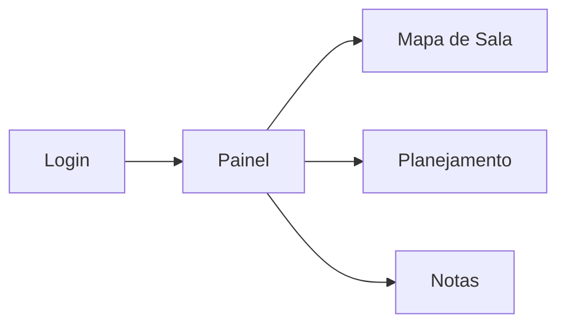

<div align="center">

# PROFM — ProfeManager

**Plataforma web para o professor organizar sala de aula, planejar aulas e acompanhar o desempenho dos alunos.**


[Começar agora](#-início-rápido) · [Funcionalidades](#-funcionalidades) · [Rotas](#-rotas) · [Estrutura](#-estrutura-do-projeto)

</div>

---

## Sobre o projeto

O **PROFM (ProfeManager)** centraliza tarefas do dia a dia do professor em uma interface moderna, com identidade visual em tons de roxo e módulos independentes acessados pelo painel principal.

| | |
|---|---|
| **Público-alvo** | Professores da educação básica e média |
| **Objetivo** | Reduzir trabalho manual em organização de turma, planejamento e notas |
| **Estado atual** | Frontend React + API FastAPI (SQLite) com autenticação JWT |

---

## Funcionalidades

<table>
  <tr>
    <th>Módulo</th>
    <th>Rota</th>
    <th>O que faz</th>
  </tr>
  <tr>
    <td>🔐 Autenticação</td>
    <td><code>/entrar</code> · <code>/criar-conta</code></td>
    <td>Login e cadastro com boas-vindas personalizadas</td>
  </tr>
  <tr>
    <td>🏠 Painel</td>
    <td><code>/boas-vindas</code></td>
    <td>Hub de serviços com mensagem <em>“Seja bem-vindo, professor [nome]!”</em></td>
  </tr>
  <tr>
    <td>🪑 Mapa de Sala</td>
    <td><code>/mapa-sala</code></td>
    <td>Matéria, alunos e regras de assento (separado, duplas ou aleatório)</td>
  </tr>
  <tr>
    <td>📅 Planejamento</td>
    <td><code>/planejamento-aula</code></td>
    <td>Assunto, livros, materiais, metodologia e avaliação</td>
  </tr>
  <tr>
    <td>📊 Notas</td>
    <td><code>/notas-desempenho</code></td>
    <td>Lançamento de notas, média automática e situação do aluno</td>
  </tr>
</table>

<details>
<summary><strong>Ver detalhes de cada módulo</strong></summary>

<br>

### Mapa de Sala
- Definição de matéria, quantidade de alunos e fileiras
- Modos: **separado**, **em duplas** ou **aleatório**
- Visualização em grade de carteiras

### Planejamento de Aula
- Informações gerais: disciplina, turma, data e duração
- Conteúdo: assunto e objetivos de aprendizagem
- Materiais: livros didáticos e recursos complementares
- Metodologia, avaliação e observações
- Lista de planejamentos salvos (editar / excluir)

### Notas e Desempenho
- Provas, trabalho e participação (escala **0 a 10**)
- Média calculada automaticamente
- Situação: **Aprovado** · **Recuperação** · **Reprovado**
- Painel com média da turma, maior/menor nota e contadores
- Filtros por disciplina e turma

</details>

---

## Fluxo da aplicação



---

## Início rápido

### 1. Pré-requisitos

- [Node.js](https://nodejs.org/) **18+**
- [pnpm](https://pnpm.io/) **10+** (recomendado)

### 2. Instalação

```bash
pnpm install
.\.venv\Scripts\pip.exe install -r backend\requirements.txt
```

Opcional: copie o ambiente do frontend:

```bash
copy .env.example .env
```

### 3. Rodar tudo (recomendado)

```bash
pnpm dev:all
```

| Serviço | URL |
|---------|-----|
| Frontend | http://localhost:5173/ |
| API | http://127.0.0.1:8000 |
| Swagger | http://127.0.0.1:8000/docs |

O Vite encaminha `/api` para o backend — não precisa configurar CORS manualmente em dev.

**Só frontend:** `pnpm dev` (requer API já rodando em outro terminal com `pnpm dev:api`).

### 4. Primeiro acesso

1. Abra http://localhost:5173/criar-conta
2. Crie usuário (senha mín. 6 caracteres)
3. Use o painel em `/boas-vindas`

Rotas internas exigem login (token JWT validado com `/api/auth/me`).

---

## Scripts disponíveis

| Comando | Descrição |
|---------|-----------|
| `pnpm dev:all` | Backend + frontend juntos |
| `pnpm dev:api` | Só API FastAPI (porta 8000, hot reload) |
| `pnpm dev` | Só frontend Vite (porta 5173, proxy `/api`) |
| `pnpm build` | Build de produção |
| `pnpm preview` | Pré-visualização do build (proxy `/api` na porta 4173) |
| `pnpm lint` | Análise estática com ESLint |

---

## Backend (FastAPI)

Documentação completa: [`backend/README.md`](backend/README.md)

```bash
pnpm dev:api
```

Principais rotas: `/api/auth/*` · `/api/classrooms` · `/api/lesson-plans` · `/api/grades`

Banco SQLite: `backend/database.db` (criado automaticamente).

---

## Estrutura do projeto

```
projetos 2026/
│
├── src/
│   ├── assets/logos/       # Identidade visual PROFM
│   ├── components/         # Layout e shell (AuthShell)
│   ├── lib/                # Sessão do usuário
│   ├── pages/              # Telas por rota
│   ├── types/              # Tipos (notas, planejamento)
│   ├── App.tsx             # Rotas
│   └── App.css / index.css # Estilos
│
├── backend/                # API Python (opcional)
├── public/
└── package.json
```

---

## Rotas

| Caminho | Página |
|---------|--------|
| `/` | Redireciona para login |
| `/entrar` | Login |
| `/criar-conta` | Cadastro |
| `/esqueci-senha` | Solicitar link de redefinição |
| `/redefinir-senha?token=...` | Definir nova senha |
| `/boas-vindas` | Painel de serviços |
| `/mapa-sala` | Mapa de sala |
| `/planejamento-aula` | Planejamento de aula |
| `/notas-desempenho` | Notas e desempenho |

---

## Sessão e persistência

| Onde | O que |
|------|--------|
| `localStorage` → `profemanager:token` | JWT de autenticação |
| `localStorage` → `profemanager:user` | Nome e e-mail (cache da sessão) |
| `backend/database.db` | Turmas, notas, planejamentos por usuário |

---

## Stack técnica

| Camada | Tecnologia |
|--------|------------|
| UI | React 19 + TypeScript |
| Build | Vite 8 |
| Rotas | React Router 7 |
| Estilo | CSS customizado (tema roxo) |
| API | FastAPI + SQLModel + SQLite + JWT |

---

<div align="center">

**PROFM** — feito para simplificar a rotina do professor.

*Projeto privado · uso educacional e demonstração*

</div>
